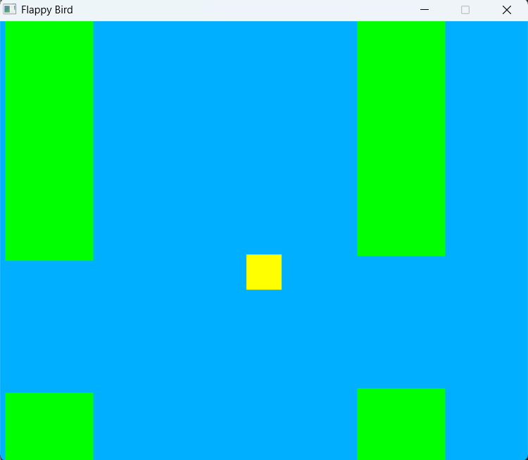

# Flappy-Bird-Asm
Thing I made (only works for windows)


## how to build
- You need nasm, gcc, and sdl2
- put libSDL2.a into the folder
- run makefile
- or run these commands
```powershell
nasm -f win64 -o main.o main.asm
gcc -o main.o -nostdlib -lkernel32 -lsdl2 -lmsvcrt
```